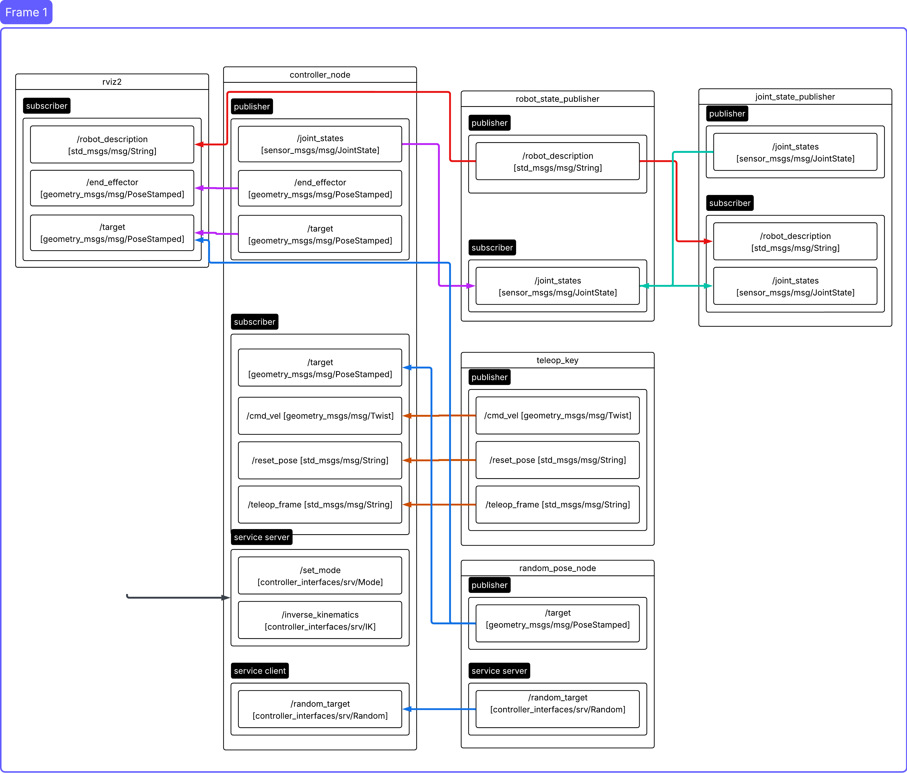

# LAB4 Manipulator 
This manipulator has 3 mode
1. TO : User can control robot via teleop_key node. In this mode has 2 sub mode which is reference from **world** and **end effector**.
2. AM : Robot will follow target point which random. If end effector reached that point random node will generate another target automatically.
3. IPK : User provided target point for the robot to reached. if given point is not available in workspace. The robot will not move.
## System Architecture


## Setup

1. **Clone the repository**
   ```bash
   cd ~/
   git clone -b LAB4 https://github.com/phattanaratjeedjeen-sudo/FRA502-LAB-6810.git

    ```
2. **Build the workspace**
   ```bash
   cd FRA502-LAB-6810
   colcon build
   source install/setup.bash
    ```
3. **Environment Setup**
   ```bash
   echo "source ~/FRA502-LAB-6810/install/setup.bash" >> ~/.bashrc  
   source ~/.bashrc
   ```
## Usage
1. **Launch lab4 launch file:**

   ```bash
   ros2 launch lab4 lab4.launch.py
   ```
2. **Default mode is TO so you need to open new terminal then run teleop_key.py**
   ```bash
   ros2 run lab4 teleop_key.py
   ```

3. **Use other mode (open new terminal)**

   3.1 IPK mode

   - change to IPK mode
   ```bash
   ros2 service call /set_mode controller_interfaces/srv/Mode "{mode: 'IPK'}"
   ```
   - give target point (for example x = 0.3, y = 0.2, z = 0.1)
   ```bash
   ros2 service call /inverse_kinematics controller_interfaces/srv/IK "target_position:
      x: 0.3
      y: 0.2
      z: 0.1" 
   ```
   3.2 AM mode

   - change to AM mode
   ```bash
   ros2 service call /set_mode controller_interfaces/srv/Mode "{mode: 'AM'}"
   ```

   3.3 TO mode
      - comback to TO mode 
      - **remember that user has to stay active on the terminal which runs teleop_key.py**
   ```bash
   ros2 service call /set_mode controller_interfaces/srv/Mode "{mode: 'TO'}"
   ```


   

